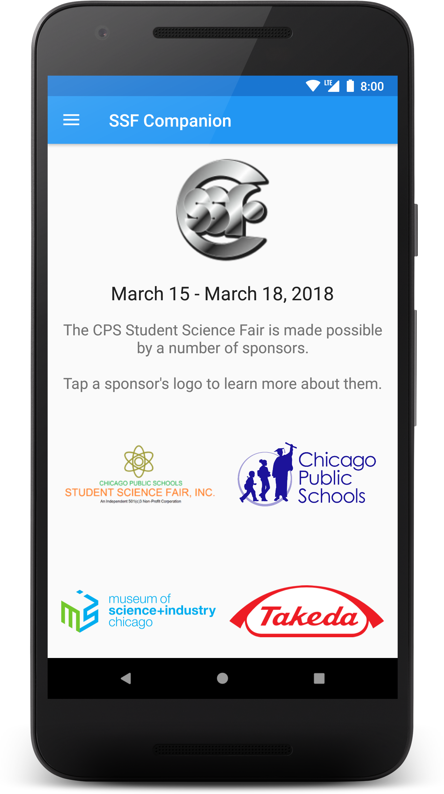
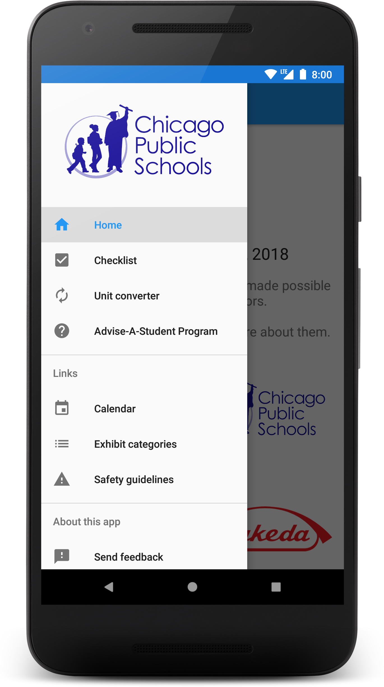
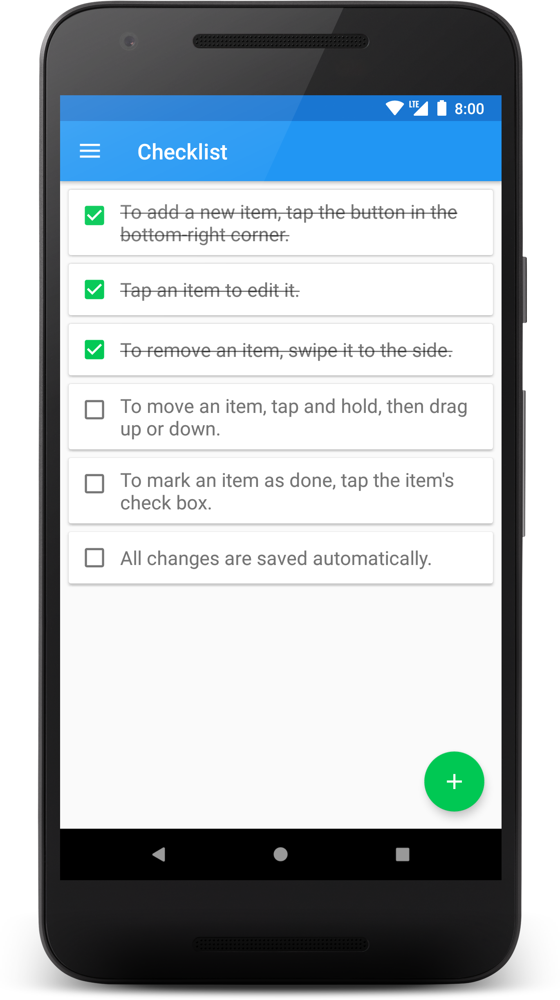
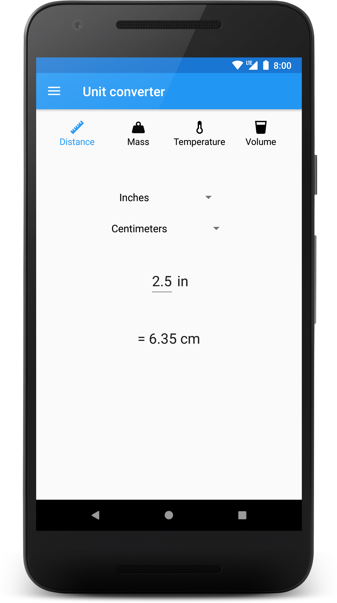

# SSF Companion

A companion app for the 2018 [Chicago Public Schools Student Science Fair](http://www.cpsscifair.org).

Includes a checklist and unit converter, as well as links to select resources on the science fair's website. 

The unit converter contains icons by [Austin Andrews](https://twitter.com/Templarian), originally retrieved from [Material Design Icons](https://materialdesignicons.com).

## Screenshots

| Home | Menu | Checklist | Unit converter |
|:-:|:-:|:-:|:-:|
 |  |  | 
